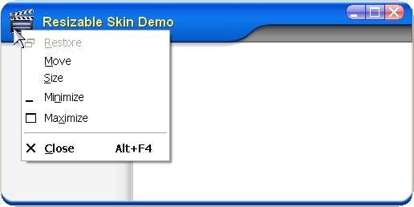



## A resizable form with skin

### Description

This is a simple peace of code to make a real sizable form with skin and the use of the form systemmenu.
 
### More Info
 

             |
---                |---
**Submitted On**   |2008-12-19 01:00:00
**By**             |[Ben Vonk](https://github.com/Planet-Source-Code/PSCIndex/blob/master/ByAuthor/ben-vonk.md)
**Level**          |Intermediate
**User Rating**    |4.7 (52 globes from 11 users)
**Compatibility**  |VB 6\.0
**Category**       |[Custom Controls/ Forms/  Menus](https://github.com/Planet-Source-Code/PSCIndex/blob/master/ByCategory/custom-controls-forms-menus__1-4.md)
**World**          |[Visual Basic](https://github.com/Planet-Source-Code/PSCIndex/blob/master/ByWorld/visual-basic.md)
**Archive File**   |[A\_resizabl2220692262012\.zip](https://github.com/Planet-Source-Code/ben-vonk-a-resizable-form-with-skin__1-71542/archive/master.zip)

